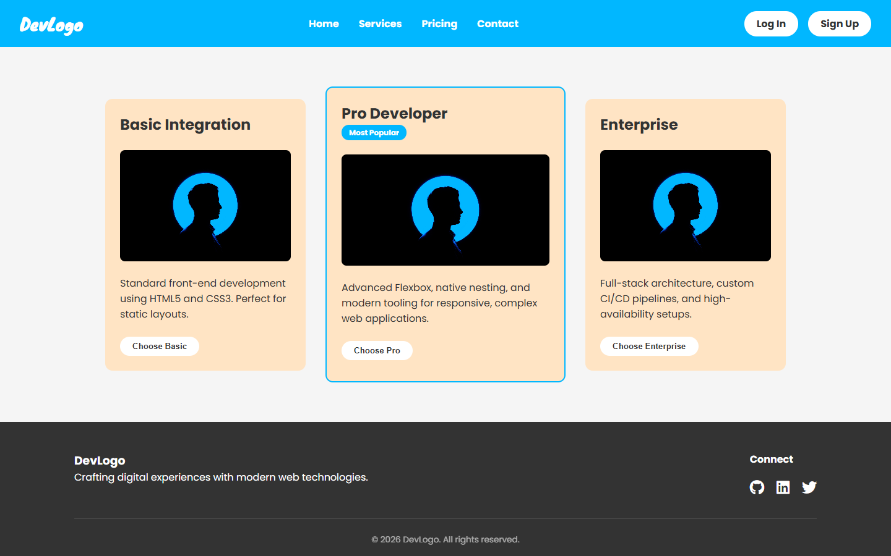
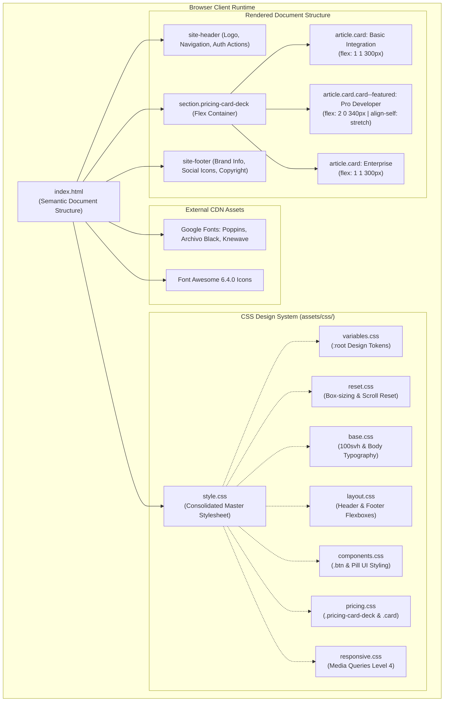

# 💳 Responsive Pricing Card Deck

<div align="center">

  <p align="center">
    A high-converting, accessible <strong>Developer Services Pricing Deck</strong> crafted with semantic HTML5 and modern CSS3. Engineered with advanced Flexbox layout mechanics, native CSS nesting, CSS custom properties, and responsive design patterns with zero external JavaScript or heavy frameworks.
  </p>

  <p align="center">
    <a href="https://bhabakjishnu.github.io/Pricing-Card-Deck/"><strong>Explore Live Demo »</strong></a>
    ·
    <a href="https://github.com/bhabakjishnu/Pricing-Card-Deck/issues">Report Bug</a>
    ·
    <a href="https://github.com/bhabakjishnu/Pricing-Card-Deck/issues">Request Feature</a>
  </p>

  <p align="center">
    
    
    
    
    
  </p>

</div>

---

## 🖥️ Desktop Preview



---

## 📑 Table of Contents

- [Overview](#-overview)
- [Key Features](#-key-features)
- [Technology Stack](#-technology-stack)
- [System & Layout Architecture](#-system--layout-architecture)
  - [Mermaid Architecture & Workflow](#mermaid-architecture--workflow)
  - [Advanced Flexbox Mechanics](#advanced-flexbox-mechanics)
  - [Native CSS Nesting](#native-css-nesting)
  - [Logical Properties & Modern Viewport Units](#logical-properties--modern-viewport-units)
- [Tier Specifications](#-tier-specifications)
- [Project Directory Structure](#-project-directory-structure)
- [Getting Started](#-getting-started)
  - [Prerequisites](#prerequisites)
  - [Installation & Local Execution](#installation--local-execution)
- [Customization Guide](#-customization-guide)
- [Security Audit & Hardening](#-security-audit--hardening)
- [Browser Compatibility](#-browser-compatibility)
- [Contributing](#-contributing)
- [License](#-license)
- [Author & Acknowledgments](#-author--acknowledgments)

---

## 📖 Overview

The **Responsive Pricing Card Deck** is an engineered developer services pricing interface designed for software agencies, consultants, and SaaS applications. It delivers an intuitive visual hierarchy that directs prospective clients toward high-value tiers, spotlighting the **"Pro Developer"** tier as the prime conversion target.

### Problem Solved
Traditional pricing pages frequently depend on heavyweight UI frameworks (Bootstrap, Tailwind) or JavaScript-driven height-matching libraries. This project demonstrates how modern CSS standards—specifically Flexbox growth weighting, native nesting, logical properties, and small viewport height units—solve layout alignment, responsive re-wrapping, and vertical button pinning with zero runtime JavaScript overhead.

### Target Use Cases
- **Agencies & Freelance Developers:** Plug-and-play pricing component for service offerings and portfolio sites.
- **Frontend Engineers:** Reference architecture for CSS-only flexible deck mechanics, design token management, and modern browser standards.

---

## ✨ Key Features

### Core Layout Features
- **Visual Conversion Anchor:** The featured "Pro Developer" card stands out through prioritized flex basis, distinct background accents, a "Most Popular" badge, and full-height vertical stretch.
- **Deck-Level Alignment:** Automated flex re-wrapping (`flex-wrap: wrap`) gracefully handles fluid viewport transitions across mobile, tablet, and widescreen displays.
- **Equalized Call-To-Action (CTA) Pinning:** Utilizes CSS `margin-block-start: auto` on card footers to guarantee all action buttons remain horizontally aligned across varying body copy lengths.

### Technical & Architectural Features
- **Zero Framework Dependency:** Pure HTML5 and vanilla CSS3—no JavaScript runtime overhead, no CSS compilation step, and zero third-party tracking scripts.
- **Native CSS Nesting:** Written directly using the W3C native CSS nesting standard (`& selector`), eliminating the need for preprocessors like Sass or Less.
- **Modern Logical Properties:** Full adoption of `padding-block`, `padding-inline`, and `margin-block-start` for modern layout flow and internationalization readiness.
- **Elimination of Mobile Viewport Jumps:** Uses `min-height: 100svh` (Small Viewport Height) to prevent abrupt visual jumps caused by dynamic mobile address bars.

### UX & Accessibility (A11y) Features
- **Semantic Landmark Hierarchy:** Built with `<header>`, `<nav>`, `<main>`, `<section>`, `<article>`, and `<footer>` elements for screen reader navigation.
- **Accessible Icon Links:** Footer social navigation links contain explicit `aria-label` attributes (`Visit our GitHub`, `Visit our LinkedIn`, `Visit our Twitter`) ensuring full screen reader accessibility.
- **Hardware-Accelerated Interactions:** Subtle micro-interactions (`translateY` and brightness filters) powered by GPU compositor layers for silky 60fps transitions.

---

## 🛠️ Technology Stack

| Category | Technology / Specification | Source / CDN | Purpose |
| :--- | :--- | :--- | :--- |
| **Markup** | HTML5 (Semantic Standard) | Native W3C Standard | Page structure, semantic landmarks, and accessibility anchors |
| **Styling** | CSS3 (Custom Properties, Flexbox, Nesting) | Native W3C Standard | Fluid layout, responsive design tokens, and hover micro-interactions |
| **Typography** | Google Fonts (*Archivo Black*, *Knewave*, *Poppins*) | `fonts.googleapis.com` | Brand identity, card headers, and readable body typography |
| **Iconography** | Font Awesome 6.4.0 (Free CDN) | `cdnjs.cloudflare.com` | Social icons in the site footer |
| **Execution Engine** | Any Modern Web Browser | Client Runtime | Renders static markup and styles with zero build pipeline |

---

## 🏛️ System & Layout Architecture

### Mermaid Architecture & Workflow

The diagram below illustrates the DOM hierarchy, CSS token flow, and layout rendering mechanics:



---

### Advanced Flexbox Mechanics

The card deck employs three synchronized Flexbox properties to achieve a balanced, responsive visual hierarchy:

```css
/* Container: Centered items with wrapping */
.pricing-card-deck {
    display: flex;
    flex-wrap: wrap;
    gap: 2rem;
    width: 100%;
    max-width: 1100px;
    align-items: center; /* Centers non-featured cards vertically */
    justify-content: center;
}

/* Standard Tier Cards */
.card {
    /* grow: 1, shrink: 1, basis: 300px */
    flex: 1 1 300px;
    display: flex;
    flex-direction: column;
}

/* Featured / Best-Value Tier Override */
.card--featured {
    /* grow: 2 (expands faster), shrink: 0 (retains min 340px), basis: 340px */
    flex: 2 0 340px; 
    
    /* Overrides container's align-items: center to stretch full height */
    align-self: stretch;
}

/* Automated Footer Alignment */
.card__footer {
    /* Automatically consumes available vertical space, pushing CTA buttons to bottom */
    margin-block-start: auto;
}
```

---

### Native CSS Nesting

The stylesheets leverage native W3C CSS Nesting, improving code locality without preprocessors:

```css
.card {
    background-color: var(--card-background);
    border-radius: 12px;
    transition: transform 0.3s ease, box-shadow 0.3s ease;

    &:hover {
        transform: translateY(-10px);
        box-shadow: 0 15px 30px rgba(0, 0, 0, 0.15);
    }

    &__header {
        display: flex;
        justify-content: space-between;
        align-items: center;
    }
}
```

---

### Logical Properties & Modern Viewport Units

- **`100svh` (Small Viewport Height):** Guarantees the body container occupies the true minimum viewport height, avoiding layout recalculations when mobile browser navigation bars show or hide.
- **CSS Logical Properties:** Uses `padding-block`, `padding-inline`, and `margin-block-start` instead of physical top/bottom/left/right properties, ensuring intrinsic alignment for international writing modes.
- **Media Queries Level 4 Range Syntax:** Simplifies viewport queries using intuitive mathematical operators:
  ```css
  @media (width <= 768px) {
      .site-header { flex-direction: column; }
      .footer__container { flex-direction: column; align-items: center; }
  }
  ```

---

## 📦 Tier Specifications

| Tier | Target Client | Highlight | Flex Specification | Sizing Behavior |
| :--- | :--- | :--- | :--- | :--- |
| **Basic Integration** | Startups & Static Sites | HTML5 & CSS3 static layout delivery | `flex: 1 1 300px` | Scales evenly; shrinks when viewport contracts |
| ⭐ **Pro Developer** *(Featured)* | High-growth applications | Modern CSS, component architecture & tooling | `flex: 2 0 340px` + `align-self: stretch` | Grows twice as fast; never shrinks below 340px; stretches full deck height |
| **Enterprise** | Large Scale Organizations | Full-stack architecture, custom CI/CD & scalability | `flex: 1 1 300px` | Scales evenly; shrinks when viewport contracts |

---

## 📁 Project Directory Structure

```text
Pricing-Card-Deck/
├── assets/
│   ├── css/
│   │   ├── base.css             # Base body styles, 100svh viewport, and typography defaults
│   │   ├── components.css       # Reusable button styles (.btn, .btn--primary) and hover states
│   │   ├── layout.css           # Header, navigation, main wrapper, and footer flexbox rules
│   │   ├── pricing.css          # Pricing card deck grid, flex basis weights, and featured card rules
│   │   ├── reset.css            # Universal box-sizing reset and smooth scrolling behavior
│   │   ├── responsive.css       # Media Queries Level 4 syntax for mobile screen breakpoints
│   │   ├── style.css            # Consolidated master stylesheet linking all component styles
│   │   └── variables.css        # Design tokens: palette colors and typography custom properties
│   └── images/
│       ├── Profile-picture.jpg  # Feature package preview illustration for pricing cards
│       └── desktop-preview.png  # High-resolution desktop screenshot of the rendered application
├── index.html                   # Semantic HTML5 entry point with accessible landmark markup
└── README.md                    # Technical documentation, architecture, and security audit report
```

---

## 🚀 Getting Started

### Prerequisites
Because this project is built entirely on native web standards, no compilation steps, package installations, or build tools are required. All you need is a modern web browser.

### Installation & Local Execution

1. **Clone the repository:**
   ```bash
   git clone https://github.com/bhabakjishnu/Pricing-Card-Deck.git
   ```

2. **Navigate into the project directory:**
   ```bash
   cd Pricing-Card-Deck
   ```

3. **Launch the application:**
   - **Direct Browser Execution:** Open `index.html` directly in any web browser.
   - **VS Code Live Server:** Right-click `index.html` and select **"Open with Live Server"**.
   - **Using Node.js (Optional):**
     ```bash
     npx serve .
     ```
   - **Using Python (Optional):**
     ```bash
     python -m http.server 8000
     ```

---

## 🎨 Customization Guide

All brand aesthetics, color palettes, and typography configurations are centralized in CSS Custom Properties inside `:root`. To adapt the project to your brand identity, update the tokens in `assets/css/variables.css` (or `assets/css/style.css`):

```css
:root {
    /* Color Palette */
    --body-background: #F5F5F5;        /* Page background canvas */
    --card-background: bisque;         /* Standard card background */
    --card-featured-bg: #ffe4c4;       /* Featured card highlight tint */
    --header-background: #01B7FF;      /* Primary accent blue */
    --text-light: #ffffff;             /* Contrasting light text */
    --text-dark: #333333;              /* Primary body text */
    --btn-background: #ffffff;         /* Secondary button background */
    --btn-primary: #01B7FF;            /* Primary action button fill */
    --footer-bg: #333333;              /* Dark footer background */
    
    /* Typography Tokens */
    --font-logo: "Knewave", system-ui;         /* Decorative brand logo font */
    --font-heading: "Archivo Black", sans-serif; /* Impactful card header font */
    --font-body: "Poppins", sans-serif;          /* Clean, modern body font */
}
```

---

## 🔒 Security Audit & Hardening

A comprehensive security audit of this repository verified that **no secrets, API keys, credentials, or personal information are stored or committed**. Because the application is a client-side static presentation page with zero backend or user input handling, attack vectors such as SQL Injection, CSRF, and Server-Side Deserialization do not apply.

However, the following hardening steps are recommended:

### 1. Subresource Integrity (SRI) for External CDN Assets
The Font Awesome stylesheet loaded in `index.html` currently lacks an `integrity` cryptographic hash. Implementing Subresource Integrity ensures the browser rejects the stylesheet if the CDN delivery is tampered with:

```html
<!-- Recommended Secure External Link -->
<link 
    rel="stylesheet" 
    href="https://cdnjs.cloudflare.com/ajax/libs/font-awesome/6.4.0/css/all.min.css" 
    integrity="sha512-iecdLmaskl7CVkqkXNQ/ZH/XLlvWZOJyj7Yy7tcenmpD1ypASozpmT/E0iPtmFIB46ZmdtAc9eNBvH0H/ZpiBw==" 
    crossorigin="anonymous" 
    referrerpolicy="no-referrer" />
```

### 2. Content Security Policy (CSP)
For production deployments, enforce a strict Content Security Policy to control allowed sources:

```html
<meta http-equiv="Content-Security-Policy" content="
    default-src 'none';
    style-src 'self' 'unsafe-inline' https://cdnjs.cloudflare.com https://fonts.googleapis.com;
    font-src 'self' https://cdnjs.cloudflare.com https://fonts.gstatic.com;
    img-src 'self' data:;
    base-uri 'self';
    form-action 'self';
">
```

### 3. Repository Hygiene (.gitignore)
To prevent accidental future commits of OS artifacts, IDE directories, or sensitive configuration files, add a `.gitignore` to the project root:

```text
# OS Metadata
.DS_Store
Thumbs.db

# Editor & IDE Directories
.vscode/
.idea/

# Environment & Local Overrides
*.env
*.env.local

# Node & Build Artifacts (if added in the future)
node_modules/
npm-debug.log*
```

---

## 🌐 Browser Compatibility

Tested and fully operational across all modern evergreen browsers supporting **W3C Native CSS Nesting** and **Media Queries Level 4**:

| Browser | Minimum Version Tested | Status |
| :--- | :--- | :--- |
| **Google Chrome** | Version 120+ | ✅ Supported |
| **Mozilla Firefox** | Version 117+ | ✅ Supported |
| **Apple Safari** | Version 17.2+ | ✅ Supported |
| **Microsoft Edge** | Version 120+ | ✅ Supported |
| **Opera** | Version 106+ | ✅ Supported |

---

## 🤝 Contributing

Contributions are welcomed! Follow these standard open-source steps:

1. **Fork the Repository**
2. **Create a Feature Branch:**
   ```bash
   git checkout -b feature/ModernizationUpdate
   ```
3. **Commit Your Changes:**
   ```bash
   git commit -m "feat: enhance responsive card deck typography"
   ```
4. **Push to the Branch:**
   ```bash
   git push origin feature/ModernizationUpdate
   ```
5. **Open a Pull Request**

---

## 📄 License

This project is distributed under the **MIT License**. For full terms, please refer to the project's license documentation.

---

## 👨‍💻 Author & Acknowledgments

**Jishnu Bhabak**
- **GitHub:** [@bhabakjishnu](https://github.com/bhabakjishnu)
- **Repository:** [Pricing-Card-Deck](https://github.com/bhabakjishnu/Pricing-Card-Deck)

<div align="center">
  <sub>Engineered with semantic web standards. If this project was useful to you, please consider starring ⭐ the repository!</sub>
</div>