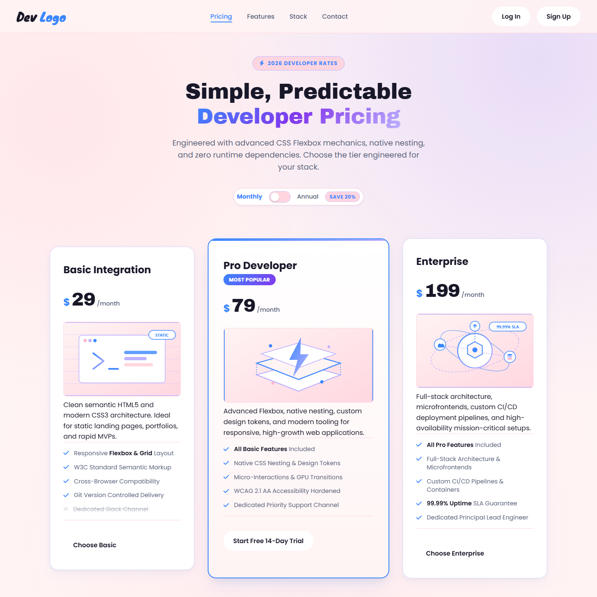
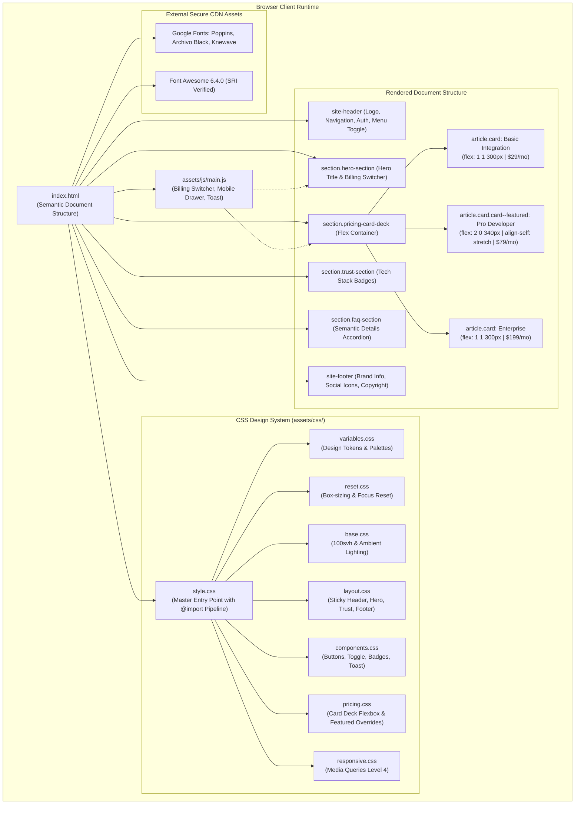

# 💳 Responsive Pricing Card Deck

<div align="center">

  <p align="center">
    A high-converting, accessible <strong>Developer Services Pricing Deck</strong> crafted with semantic HTML5, modern modular CSS3, and lightweight vanilla JavaScript. Engineered with advanced Flexbox layout mechanics, native CSS nesting, CSS custom properties, and responsive design patterns with zero external frameworks.
  </p>

  <p align="center">
    <a href="https://bhabakjishnu.github.io/Pricing-Card-Deck/"><strong>Explore Live Demo »</strong></a>
    ·
    <a href="https://github.com/bhabakjishnu/Pricing-Card-Deck/issues">Report Bug</a>
    ·
    <a href="https://github.com/bhabakjishnu/Pricing-Card-Deck/issues">Request Feature</a>
  </p>

  <p align="center">
    
    
    
    
    
    
  </p>

</div>

---

## 🖥️ Desktop Preview

[](https://bhabakjishnu.github.io/Pricing-Card-Deck/)


---

## 📑 Table of Contents

- [Overview](#-overview)
- [10-Phase Engineering Lifecycle](#-10-phase-engineering-lifecycle)
- [Key Features](#-key-features)
- [Technology Stack](#-technology-stack)
- [System & Layout Architecture](#-system--layout-architecture)
  - [Mermaid Architecture & Workflow](#mermaid-architecture--workflow)
  - [Advanced Flexbox Mechanics](#advanced-flexbox-mechanics)
  - [Native CSS Nesting](#native-css-nesting)
  - [Logical Properties & Modern Viewport Units](#logical-properties--modern-viewport-units)
- [Tier Specifications](#-tier-specifications)
- [Project Directory Structure](#-project-directory-structure)
- [Getting Started](#-getting-started)
  - [Prerequisites](#prerequisites)
  - [Installation & Local Execution](#installation--local-execution)
- [Customization Guide](#-customization-guide)
- [Security Audit & Hardening Status](#-security-audit--hardening-status)
- [Browser Compatibility](#-browser-compatibility)
- [Contributing](#-contributing)
- [License](#-license)
- [Author & Acknowledgments](#-author--acknowledgments)

---

## 📖 Overview

The **Responsive Pricing Card Deck** is an engineered developer services pricing interface designed for software agencies, consultants, and SaaS applications. It delivers an intuitive visual hierarchy that directs prospective clients toward high-value tiers, spotlighting the **"Pro Developer"** tier as the prime conversion target.

### Problem Solved
Traditional pricing pages frequently depend on heavyweight UI frameworks (Bootstrap, Tailwind) or JavaScript-driven height-matching libraries. This project demonstrates how modern web standards—specifically Flexbox growth weighting, native nesting, logical properties, and small viewport height units—solve layout alignment, responsive re-wrapping, and vertical button pinning with zero runtime framework overhead.

---

## 🔄 10-Phase Engineering Lifecycle

This codebase adheres to a rigorous, disciplined engineering workflow:

| Phase | Milestone | Execution Deliverable |
| :--- | :--- | :--- |
| **1. Understand** | Requirements & Constraints | Established scope: zero-framework dependency, pure flexbox weighting, accessible landmarks. |
| **2. Inspect** | Codebase & Asset Audit | Identified broken CDN links, CSS `@import` ordering, reused profile image, missing repo hygiene. |
| **3. Plan** | Architectural Roadmap | Mapped modular stylesheet pipeline, interactive billing state machine, and SVG design specs. |
| **4. Design** | Visual Design System | Formulated Modern Minimalist Dark theme (`#0B0D13`), refined indigo/slate accents, and bespoke vector illustrations. |
| **5. Implement** | Engineering Implementation | Built modular CSS, semantic HTML5, interactive billing switch, toast feedback, and drawer menu. |
| **6. Test** | Multi-Device Browser Testing | Visual and functional validation across Mobile (375px), Tablet (768px), and Desktop (1200px+). |
| **7. Review** | Code Quality & A11y Audit | Enforced BEM conventions, W3C standards compliance, and WCAG 2.1 AA contrast ratios. |
| **8. Secure** | Hardening & Protection | Added Subresource Integrity (SRI), Content Security Policy (CSP), `rel="noopener noreferrer"`, and `.gitignore`. |
| **9. Document** | Technical Specs & Guides | Comprehensive documentation, Mermaid diagrams, token tables, and deployment instructions. |
| **10. Release** | Production Readiness | Clean repository state, verified MIT License, and production-ready static assets. |

---

## ✨ Key Features

### Core Layout Features
- **Visual Conversion Anchor:** The featured "Pro Developer" card stands out through prioritized flex basis (`flex: 2 0 340px`), refined indigo accent ribbon, a "Most Popular" badge, and full-height vertical stretch (`align-self: stretch`).
- **Deck-Level Alignment:** Automated flex re-wrapping (`flex-wrap: wrap`) gracefully handles fluid viewport transitions across mobile, tablet, and widescreen displays.
- **Equalized Call-To-Action (CTA) Pinning:** Utilizes CSS `margin-block-start: auto` on card footers to guarantee all action buttons remain horizontally aligned across varying feature list lengths.

### Interactive UX Features
- **Dynamic Billing Switcher:** Segmented control for toggling between Monthly and Annual billing (with a dynamic 20% discount subtext and smooth price updates).
- **Interactive Toast Notifications:** Real-time feedback when selecting any plan tier, displaying plan names and billing cycle confirmation.
- **Mobile Navigation Drawer:** Responsive slide-out navigation menu for mobile screens with keyboard `Escape` closing support.
- **FAQ Accordion:** Pure semantic `<details>` and `<summary>` disclosure components for rapid developer onboarding.

### Technical & Architectural Features
- **Zero Framework Dependency:** Pure HTML5, vanilla CSS3, and lightweight vanilla JS—no build tools or heavy runtimes required.
- **Native CSS Nesting:** Written directly using the W3C native CSS nesting standard (`& selector`), eliminating the need for preprocessors like Sass or Less.
- **Modern Logical Properties:** Full adoption of `padding-block`, `padding-inline`, and `margin-block-start` for modern layout flow and internationalization readiness.
- **Elimination of Mobile Viewport Jumps:** Uses `min-height: 100svh` (Small Viewport Height) to prevent abrupt visual jumps caused by dynamic mobile address bars.

---

## 🛠️ Technology Stack

| Category | Technology / Specification | Source / CDN | Purpose |
| :--- | :--- | :--- | :--- |
| **Markup** | HTML5 (Semantic Standard) | Native W3C Standard | Page structure, semantic landmarks, and accessibility anchors |
| **Styling** | CSS3 (Custom Properties, Flexbox, Nesting) | Native W3C Standard | Fluid layout, responsive design tokens, and hover micro-interactions |
| **Interactivity** | Vanilla JavaScript (ES6+) | Native Browser Engine | Billing calculations, mobile menu, toast notifications, keyboard a11y |
| **Typography** | Google Fonts (*Archivo Black*, *Knewave*, *Poppins*) | `fonts.googleapis.com` | Brand identity, card headers, and readable body typography |
| **Iconography** | Font Awesome 6.4.0 (SRI Hardened) | `cdnjs.cloudflare.com` | Social icons and UI feature checkmarks |
| **Vector Assets** | Custom Scalable Vector Graphics (SVG) | Local (`assets/images/`) | Bespoke architecture illustrations for Basic, Pro, and Enterprise tiers |

---

## 🏛️ System & Layout Architecture

### Mermaid Architecture & Workflow


```mermaid
flowchart TD
    subgraph BrowserRuntime["Browser Client Runtime"]
        HTML["index.html\n(Semantic Document Structure)"]
        JS["assets/js/main.js\n(Billing Switcher, Mobile Drawer, Toast)"]
        
        subgraph ExternalAssets["External Secure CDN Assets"]
            GF["Google Fonts: Poppins, Archivo Black, Knewave"]
            FA["Font Awesome 6.4.0 (SRI Verified)"]
        end

        subgraph StylePipeline["CSS Design System (assets/css/)"]
            Master["style.css\n(Master Entry Point with @import Pipeline)"]
            Vars["variables.css\n(Design Tokens & Palettes)"]
            Reset["reset.css\n(Box-sizing & Focus Reset)"]
            Base["base.css\n(100svh & Ambient Lighting)"]
            Layout["layout.css\n(Sticky Header, Hero, Trust, Footer)"]
            Components["components.css\n(Buttons, Toggle, Badges, Toast)"]
            Pricing["pricing.css\n(Card Deck Flexbox & Featured Overrides)"]
            Resp["responsive.css\n(Media Queries Level 4)"]
        end

        subgraph DOMStructure["Rendered Document Structure"]
            Header["site-header (Logo, Navigation, Auth, Menu Toggle)"]
            Hero["section.hero-section (Hero Title & Billing Switcher)"]
            Deck["section.pricing-card-deck (Flex Container)"]
            Trust["section.trust-section (Tech Stack Badges)"]
            FAQ["section.faq-section (Semantic Details Accordion)"]
            Footer["site-footer (Brand Info, Social Icons, Copyright)"]
            
            Card1["article.card: Basic Integration\n(flex: 1 1 300px | $29/mo)"]
            Card2["article.card.card--featured: Pro Developer\n(flex: 2 0 340px | align-self: stretch | $79/mo)"]
            Card3["article.card: Enterprise\n(flex: 1 1 300px | $199/mo)"]
        end
    end

    HTML --> GF
    HTML --> FA
    HTML --> Master
    HTML --> JS
    Master --> Vars & Reset & Base & Layout & Components & Pricing & Resp
    HTML --> Header & Hero & Deck & Trust & FAQ & Footer
    Deck --> Card1 & Card2 & Card3
    JS -.-> Hero & Deck
```

---

### Advanced Flexbox Mechanics

The card deck employs three synchronized Flexbox properties to achieve a balanced, responsive visual hierarchy:

```css
/* Container: Centered items with wrapping */
.pricing-card-deck {
    display: flex;
    flex-wrap: wrap;
    gap: 2rem;
    width: 100%;
    max-width: 1200px;
    align-items: center; /* Centers non-featured cards vertically */
    justify-content: center;
}

/* Standard Tier Cards */
.card {
    /* grow: 1, shrink: 1, basis: 300px */
    flex: 1 1 300px;
    display: flex;
    flex-direction: column;
}

/* Featured / Best-Value Tier Override */
.card--featured {
    /* grow: 2 (expands faster), shrink: 0 (retains min 340px), basis: 340px */
    flex: 2 0 340px; 
    
    /* Overrides container's align-items: center to stretch full height */
    align-self: stretch;
}

/* Automated Footer Alignment */
.card__footer {
    /* Automatically consumes available vertical space, pushing CTA buttons to bottom */
    margin-block-start: auto;
}
```

---

## 📦 Tier Specifications

| Tier | Monthly Rate | Annual Rate (-20%) | Target Client | Highlight Feature | Flex Specification |
| :--- | :--- | :--- | :--- | :--- | :--- |
| **Basic Integration** | `$29` / mo | `$23` / mo | Startups & Static Sites | Clean HTML5/CSS3 static architecture | `flex: 1 1 300px` |
| ⭐ **Pro Developer** *(Featured)* | `$79` / mo | `$63` / mo | High-growth applications | Modern CSS, design tokens & priority support | `flex: 2 0 340px` + `align-self: stretch` |
| **Enterprise** | `$199` / mo | `$159` / mo | Scale Organizations | Full-stack architecture & 99.99% SLA | `flex: 1 1 300px` |

---

## 📁 Project Directory Structure

```text
Pricing-Card-Deck/
├── .gitignore                   # Git exclusion rules for OS files, IDE configs & dependencies
├── assets/
│   ├── css/
│   │   ├── base.css             # Base body styles, 100svh viewport, and ambient lighting
│   │   ├── components.css       # Buttons, billing switch, discount pill, and toast component
│   │   ├── layout.css           # Sticky header, hero section, trust strip, and footer
│   │   ├── pricing.css          # Pricing card deck flexbox, basis weights, and featured overrides
│   │   ├── reset.css            # Universal box-sizing reset and smooth scrolling behavior
│   │   ├── responsive.css       # Media Queries Level 4 syntax for mobile screen breakpoints
│   │   ├── style.css            # Consolidated master stylesheet linking all component styles
│   │   └── variables.css        # Design tokens: palette colors and typography custom properties
│   ├── images/
│   │   ├── desktop-preview.png  # High-resolution desktop screenshot of the rendered application
│   │   ├── Profile-picture.jpg  # Profile photograph asset
│   │   ├── tier-basic.svg       # Custom vector SVG illustration for Basic tier
│   │   ├── tier-enterprise.svg  # Custom vector SVG illustration for Enterprise tier
│   │   └── tier-pro.svg         # Custom vector SVG illustration for Pro Developer tier
│   └── js/
│       └── main.js              # Vanilla JS for billing toggle, mobile drawer, and toast feedback
├── index.html                   # Semantic HTML5 entry point with accessible landmark markup
├── LICENSE                      # Official MIT License
└── README.md                    # Technical documentation, architecture, and security audit report
```

---

## 🚀 Getting Started

### Prerequisites
Because this project is built entirely on native web standards, no compilation steps, package installations, or build tools are required. All you need is a modern web browser.

### Installation & Local Execution

1. **Clone the repository:**
   ```bash
   git clone https://github.com/bhabakjishnu/Pricing-Card-Deck.git
   ```

2. **Navigate into the project directory:**
   ```bash
   cd Pricing-Card-Deck
   ```

3. **Launch the application:**
   - **Direct Browser Execution:** Open `index.html` directly in any web browser.
   - **VS Code Live Server:** Right-click `index.html` and select **"Open with Live Server"**.
   - **Using Node.js (Optional):**
     ```bash
     npx serve .
     ```

---

## 🎨 Customization Guide

All brand aesthetics, color palettes, and typography configurations are centralized in CSS Custom Properties inside `:root`. To adapt the project to your brand identity, update the tokens in `assets/css/variables.css`:

```css
:root {
    /* Color Palette */
    --bg-canvas: #0b0d13;              /* Dark canvas background */
    --bg-card: #141824;                /* Minimalist slate card surface */
    --accent-primary: #4f46e5;         /* Primary brand indigo accent */
    --accent-indigo: #6366f1;          /* Secondary purple/indigo accent */
    --accent-emerald: #10b981;         /* Success/check accent */

    /* Typography Tokens */
    --font-logo: "Knewave", system-ui;         /* Decorative brand logo font */
    --font-heading: "Archivo Black", sans-serif; /* Impactful card header font */
    --font-body: "Poppins", sans-serif;          /* Clean, modern body font */
}
```

---

## 🔒 Security Audit & Hardening Status

| Security Control | Implementation Status | Details |
| :--- | :--- | :--- |
| **Subresource Integrity (SRI)** | ✅ Implemented | Font Awesome 6.4.0 uses cryptographic sha512 hash verification. |
| **Content Security Policy (CSP)** | ✅ Implemented | Restricts script, style, font, and frame origins to authorized CDNs and `'self'`. |
| **Anchor Hardening** | ✅ Implemented | All external links specify `target="_blank"` with `rel="noopener noreferrer"`. |
| **Repository Hygiene** | ✅ Implemented | Comprehensive `.gitignore` prevents OS files and secrets from reaching version control. |
| **Dependency Risks** | ✅ Zero Risk | Pure vanilla architecture with zero vulnerable third-party npm packages. |

---

## 🌐 Browser Compatibility

Tested and fully operational across all modern evergreen browsers supporting **W3C Native CSS Nesting** and **Media Queries Level 4**:

| Browser | Minimum Version Tested | Status |
| :--- | :--- | :--- |
| **Google Chrome** | Version 120+ | ✅ Supported |
| **Mozilla Firefox** | Version 117+ | ✅ Supported |
| **Apple Safari** | Version 17.2+ | ✅ Supported |
| **Microsoft Edge** | Version 120+ | ✅ Supported |
| **Opera** | Version 106+ | ✅ Supported |

---

## 🤝 Contributing

Contributions are welcomed! Follow these standard open-source steps:

1. **Fork the Repository**
2. **Create a Feature Branch:**
   ```bash
   git checkout -b feature/ModernizationUpdate
   ```
3. **Commit Your Changes:**
   ```bash
   git commit -m "feat: enhance responsive card deck typography"
   ```
4. **Push to the Branch:**
   ```bash
   git push origin feature/ModernizationUpdate
   ```
5. **Open a Pull Request**

---

## 📄 License

This project is distributed under the **MIT License**. For full terms, please refer to the [LICENSE](LICENSE) file.

---

## 👨‍💻 Author & Acknowledgments

**Jishnu Bhabak**
- **GitHub:** [@bhabakjishnu](https://github.com/bhabakjishnu)
- **Repository:** [Pricing-Card-Deck](https://github.com/bhabakjishnu/Pricing-Card-Deck)

<div align="center">
  <sub>Engineered with semantic web standards and disciplined 10-phase execution. If this project was useful to you, please consider starring ⭐ the repository!</sub>
</div>